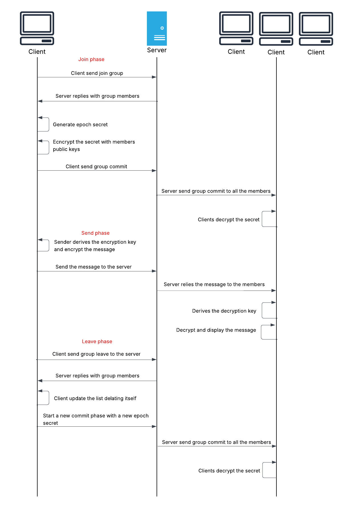

# Network Security Project

This project implements a **secure peer-to-peer messaging system** over **WebSockets and TLS**, with **application-layer end-to-end encryption** to ensure privacy even if the server is compromised.

---

## Network Architecture

<p align="center">
  
</p>

- **Transport**: Communication occurs over **WebSockets over TLS (`wss://`)**.
- **Server Role**: The server is a passive relay that forwards encrypted messages between clients without decrypting or inspecting them.
- **Client Role**: Clients handle all cryptographic operations, including identity verification, key exchange, encryption, and decryption.

---

## Transport Security: TLS

The project uses **TLS (Transport Layer Security)** to secure all WebSocket communication between clients and the server.

- The server generates a self-signed RSA certificate on startup (for testing).
- The WebSocket connection is upgraded to **`wss://`**, ensuring:
  - **Confidentiality**: Messages in transit are encrypted.
  - **Integrity**: Tampering is detectable.
  - **Authentication**: Prevents MITM attacks at the transport level.

> TLS is the **first layer of defense**, protecting against passive eavesdropping and active network-level attacks.  
> On top of this, application-layer encryption ensures true end-to-end security.

---

## Application-Layer Protocol

### Message Types

All communication between clients and server is done using **JSON messages** over the WSS connection. Examples:

- `hello`, `register`: Identity handshake
- `get_pubkey`: Public key lookup
- `chat_request`, `chat_response`, `chat_terminate`: Session control
- `relay`: Encrypted message forwarding
- `user_list`: Periodic active user polling

### Server Responsibilities

- Maintain WebSocket connections per active user.
- Store and distribute registered identity public keys (Ed25519).
- Relay encrypted handshakes and chat messages without inspecting them.
- Act as a **zero-trust message broker**.

---

## End-to-End Encryption (E2EE)

<p align="center">
  
</p>

### Cryptographic Protocol Summary

- **Identity Keys**:
  - Each client has a persistent **Ed25519** key pair (stored locally).
  - Used to sign ephemeral keys during the handshake for authenticity.
- **Ephemeral Session Keys**:
  - For each new session, a fresh **X25519** key pair is generated.
  - Exchanged via the server, signed with the identity key.
- **Session Key Derivation**:
  - Shared secret from X25519 ECDH → **HKDF (SHA-256)** → two AES-256-GCM keys (send/receive).
- **Forward Secrecy**:
  - New ephemeral keys are generated for every session.

---

## Message Encryption

<p align="center">
  
</p>

- **AES-256-GCM** provides:
  - **Confidentiality**: Message content is unreadable to third parties.
  - **Integrity & Authenticity**: GCM’s authentication tag prevents undetected tampering.
- **Nonces**:
  - Derived from message counters to ensure uniqueness.
- **Associated Data**:
  - Includes metadata (sender, recipient, type) to bind encryption to message context.

---

## Message Delivery Flow

```text
1. Client A connects to server via WSS and registers identity.
2. Client A sends a chat request to Client B via the server.
3. Both clients exchange signed ephemeral keys through the server.
4. Each verifies the other’s signature and derives the session key via X25519 + HKDF.
5. All chat messages are encrypted with AES-GCM and relayed.
6. The server forwards encrypted payloads without accessing content.
7. Session can be terminated by either client, discarding keys.
   ```

## Broadcast Chat

The broadcast chat feature allows all connected clients to communicate in a shared group. It is implemented using a group-based encryption protocol to ensure secure communication.

### Joining the Broadcast Chat
1. When a client joins the broadcast chat, it sends a `group_join` request to the server.
2. The client acts as the committer, generating a new **epoch secret** and including itself in the group.
3. The **epoch secret** is encrypted for each group member using their X25519 public keys and sent as part of a `GROUP_COMMIT` message.
4. The group state is updated locally, and the client can immediately start sending and receiving messages.

### Sending Messages
1. Each message is encrypted using **AES-256-GCM** with a key derived from the current **epoch secret**.
2. The encryption process includes:
   - A unique counter for each message to ensure nonce uniqueness.
   - Associated data (e.g., group ID, sender, and counter) to bind the encryption context.
3. The encrypted message is sent to the server as a `group_message` payload.
4. The server relays the encrypted message to all group members without inspecting its content.

### Receiving Messages
1. When a client receives a `group_message`, it decrypts the message using the current **epoch secret**.
2. The associated data and authentication tag are verified to ensure the message's integrity and authenticity.
3. The decrypted message is displayed in the chat interface.

### Leaving the Broadcast Chat
1. When a client leaves the broadcast chat, it sends a `group_leave` request to the server.
2. The client acts as the committer, generating a new **epoch secret** that excludes itself from the group.
3. The remaining members receive the updated group state and can continue communicating securely.

<p align="center">
  
</p>


## Usage

### Requirements
1. Ensure you have Python 3.10+ installed.
2. Install the required dependencies by running:
   ```bash
   pip install -r requirements.txt
    ```

### Running the server
The server must be running before any clients connect.
1. Open a terminal.
2. Navigate to the project directory.
2. Start the server by running:
    ```bash
    python server.py
    ```

### Running a client
1. Open a new terminal window.
2. Navigate to the project directory.
3. Start a client by running:
    ```bash
    python client.py
    ```
4. Enter your username when prompted.
5. Use the graphical interface to chat in a secure way with another client or with the broadcast chat.

<p align="center">
  
</p>
